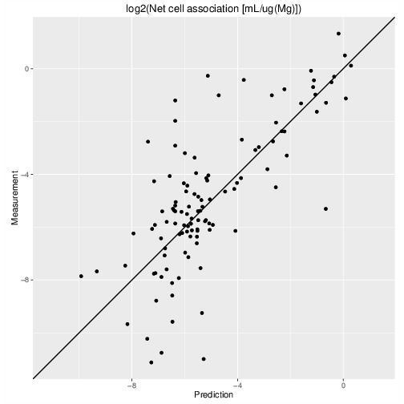
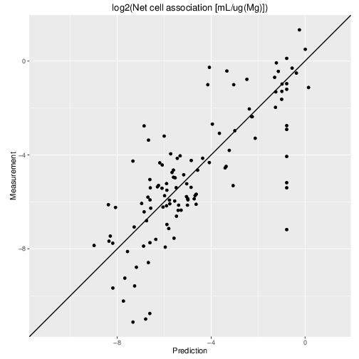

% `nano-lazar`: A framework for nanoparticle read across risk assessment
% Christoph Helma, Micha Rautenberg, Denis Gebele
% in silico toxicology gmbh,  Basel, Switzerland
  \
  \
  \
  

# `nano-lazar` framework

Framework for reproducible read-across (k-nearest-neighbor) predictions

For a given query substance (nanoparticle)

- Find similar substances (neighbors)
- Create local model with neighbor activities
- Apply local model to predict the query substance

# `nano-lazar` algorithms

Free choice of algorithms and parameters for

- Descriptors (measured, calculated)
- Feature selection
- Similarity calculation
- Local QSAR models

Reasonable default algorithms and parameters

# `nano-lazar` experiments

Endpoint:
  ~ Net cell association (121 Gold and Silver particles)

Descriptors:
  ~ Calculated fingerprints (new development), measured physchem properties, protein interactions

Feature selection:
  ~ Correlation filter (measured properties)

Similarity:
  ~ Weighted cosine (measured properties), Tanimoto/Jaccard (fingerprints)

Local regression:
  ~ Weighted average, partial least squares (PLS), random forests (RF)

- Five independent 10-fold crossvalidations
- *No* fixed random seed for training/test set splits, to avoid overfitting and to demonstrate the variability of validation results due to random training/test splits.
- Separate feature selection for each training dataset to avoid overfitting 

# `nano-lazar` validation results

<!--  -->

Gold *and* silver particles included!

# `nano-lazar` prediction correlation

{#fig:prot0 width=18%}
{#fig:prot1 width=18%}
{#fig:prot2 width=18%}
{#fig:prot3 width=18%}
{#fig:prot4 width=18%}

Correlation of predicted vs. measured values for five independent crossvalidations with *Proteomics* descriptors and local *random forest* models

# `nano-lazar` validation summary

Best results:
  ~ Protein interaction descriptors and random forest models

- Few significantly worse results
- Calculated fingerprints perform surprisingly well (RMSE comparable to best results) and do not require 
measured nanoparticle properties

# `nano-lazar` GUI

  {#id .class height=50%}

# `nano-lazar` GUI

{#id .class height=50%}

# Links

Nano-lazar GUI
  : <https://nano-lazar.in-silico.ch>

Lazar (source code)
  : <https://github.com/opentox/lazar>

Publication (source code)
  : <https://github.com/opentox/nano-lazar-paper>

Docker image
  : <https://hub.docker.com/r/insilicotox/nano-lazar-paper/>

Twitter
~ <https://twitter.com/insilicotox>

Email
~ <helma@in-silico.ch>
