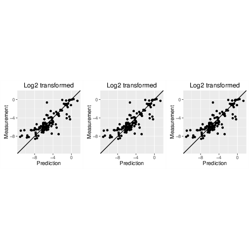

% Nanomaterial read across predictions with nano-lazar
% Christoph Helma, Micha Rautenberg, Denis Gebele
% in silico toxicology gmbh,  Basel, Switzerland
  \
  \
  \
  

Contents
========

- `lazar` read across framework
- Adjustments for nanoparticles
- Data requirements
- Comparison of algorithms and descriptors
- Exercises
- Feedback

`lazar` read across framework 
===========================

A reproducible version of the read across procedure commonly used in toxicological risk assessment (based on the k-nearest-neighbor algorithm)

- Search in a database for similar nanoparticles (*neighbors*)
- Build a local QSAR model with these neighbors
- Use this model to predict the activity of the query substance

`lazar` was originally designed for small molecules with a defined chemical structure. The nanoparticle extension was developed and  validated within the eNanoMapper project. 

Similarity calculation
======================

Requirements
  : Descriptors (features) for the query substance and the neighbor candidate

Observation
  : A large number of irrelevant features can lead do meaningless similarity estimates

Relevant features
  : Features that correlate significantly with toxicity (Pearson correlation p-value < 0.05) 

Weighted cosine similarity
  : 
    - Scaled and centered *relevant feature* vectors
    - Feature contributions weighted by Pearson correlation coefficient
    - Similarity threshold: $sim > 0.5$ 

Local regression algorithms
===========================

- Weighted average 
- Weighted partial least squares regression
- Weighted random forests

Partial least squares and random forest models use the `caret` R package with default settings

Prediction intervals: 1.96*RMSE of `caret`s bootstrapped model predictions

If PLS/RF modelling or prediction fails, `lazar` resorts to using the weighted
average method.

Validation
==========

- 3 repeated 10-fold crossvalidations with independent training/test
set splits
- *No* fixed random seed for training/test set splits, to avoid overfitting and to demonstrate the variability of validation results due to random training/test splits.
- Separate feature selection for each training dataset to avoid overfitting 

Data requirements
=================

- At least 100 examples per toxicity endpoint for statistically meaningful validation results
- At least non-empty intersection of descriptors for calculation of similarities

*Net cell association* endpoint of the *Protein corona* dataset (121 gold and silver particles)

10-fold crossvalidations
========================

Descriptors | Algorithm           | $r^2$ | RMSE | 
------------|---------------------|-------|------|--
Physchem | WA | `! scripts/values.rb weighted_average P-CHEM r_squared` | `! scripts/values.rb weighted_average P-CHEM rmse` | 
Physchem | PLS | `! scripts/values.rb pls P-CHEM r_squared` | `! scripts/values.rb pls P-CHEM rmse` |
Physchem |RF | `! scripts/values.rb random_forests P-CHEM r_squared` | `! scripts/values.rb random_forests P-CHEM rmse` |
Proteomics | WA  | `! scripts/values.rb weighted_average Proteomics r_squared` | `! scripts/values.rb weighted_average Proteomics rmse` | 
Proteomics | PLS | `! scripts/values.rb pls Proteomics r_squared` | `! scripts/values.rb pls Proteomics rmse` |
Proteomics | RF |  `! scripts/values.rb random_forests Proteomics r_squared` | `! scripts/values.rb random_forests Proteomics rmse` |
All | WA | `! scripts/values.rb weighted_average all r_squared` | `! scripts/values.rb weighted_average all rmse` 
All | PLS | `! scripts/values.rb pls all r_squared` | `! scripts/values.rb pls all rmse` 
All |RF |  `! scripts/values.rb random_forests all r_squared` | `! scripts/values.rb random_forests all rmse`

Gold *and* silver particles included!

Correlation plot
================

Links
=====

Nano-lazar GUI
  : <https://nano-lazar.in-silico.ch>

Lazar (source code)
  : <https://github.com/opentox/lazar>

Presentation (source code)
  : <https://github.com/opentox/nano-lazar-paper>

Docker image
  : <https://hub.docker.com/r/insilicotox/nano-lazar-paper/>

Nano-lazar development version
  : <https://nano-lazar-dev.in-silico.ch/predict>

Exercises
=========

Try the nano-lazar versions at

Old (stable) version (physchem only)
  : <https://nano-lazar.in-silico.ch>

Next release
  : <https://nano-lazar-dev.in-silico.ch/predict>

Questions
=========

- Do you think that nanoparticle predictions based on physchem parameters are a *practical* approach
- Do you think that nanoparticle predictions based on proteomics measurements are a *practical* approach
- What would you expect from a nanoparticle read-across application
    * User input
    * Prediction output
- Comments, bug reports and feature suggestions
